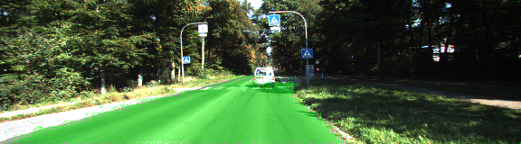

# Semantic Segmentation
### Introduction
Fully Convolutional Network (FCN) is used to segment roads for slelf driving car project.


### Setup
##### Frameworks and Packages
You need the following to be installed:
 - [Python 3](https://www.python.org/)
 - [TensorFlow](https://www.tensorflow.org/)
 - [NumPy](http://www.numpy.org/)
 - [SciPy](https://www.scipy.org/)
##### Dataset
For training download the [Kitti Road dataset](http://www.cvlibs.net/datasets/kitti/eval_road.php) from [here](http://www.cvlibs.net/download.php?file=data_road.zip).  Extract the dataset in the `data` folder.  This will create the folder `data_road` with all the training a test images.

 
##### Run
Run the following command to run the project:
```
python main.py
```

### Output

 
